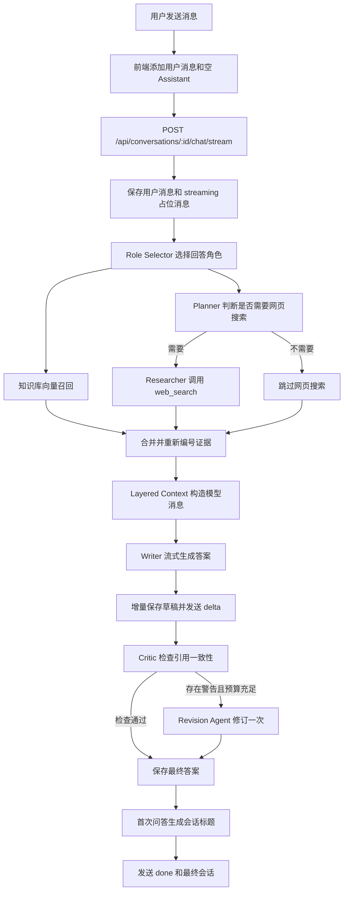
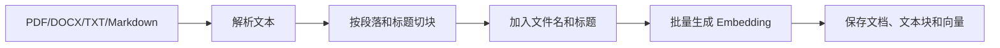

# AnimalAgent 工作流与代码构建指南

这份文档用于解释 AnimalAgent 的业务流程、代码分层，以及一轮聊天请求在项目中如何运行。

## 1. 系统定位

AnimalAgent 不是一个让模型自由循环、自由调用工具的全自治 Agent。

它更接近一个由后端代码控制流程的编排式多 Agent 系统：

- 后端代码决定执行顺序、失败处理和调用预算。
- Role Selector 使用本地规则选择回答角色。
- Planner 使用 LLM 判断是否需要网页搜索。
- 知识库检索是每轮默认尝试的 RAG 支路。
- Writer 使用 LLM 流式生成答案。
- Critic 使用确定性规则检查引用。
- Revision Agent 只在需要时调用一次 LLM 修订答案。
- TitleAgent 在首次完整问答后生成会话标题。

## 2. 一轮聊天的完整流程



主流程可以简化为：

```text
用户提问
  -> 保存消息
  -> 选择角色
  -> 知识库召回 + 网页搜索规划
  -> 合并证据
  -> 构造上下文
  -> Writer 流式回答
  -> Critic 检查
  -> 必要时修订
  -> 保存答案和标题
```

## 3. 推荐阅读顺序

不要按照目录逐个文件阅读，建议沿着一次聊天请求向下追踪：

```text
src/composables/useConversations.js
  -> src/services/chatStream.js
  -> backend/routes/apiRoutes.js
  -> backend/services/chatService.js
  -> backend/agents/animalAgentOrchestrator.js
  -> backend/services/searchService.js
  -> backend/services/knowledgeService.js
  -> backend/context/layeredContext.js
  -> backend/services/llmService.js
  -> backend/repositories/*
```

## 4. 前端状态层

核心文件：

- `src/composables/useConversations.js`
- `src/services/chatStream.js`
- `src/services/chatApi.js`

### 4.1 发送消息

`useConversations.send()` 会先在前端乐观添加两条消息：

```js
state.activeConversation.messages.push({
  role: "user",
  content: text,
  sources: []
});

state.streamingIndex =
  state.activeConversation.messages.push({
    role: "assistant",
    content: "",
    sources: []
  }) - 1;
```

然后请求：

```text
POST /api/conversations/:id/chat/stream
```

### 4.2 消费 SSE 事件

后端通过 SSE 返回以下事件：

| 事件 | 作用 |
| --- | --- |
| `status` | 告知当前 Agent 执行阶段 |
| `sources` | 返回知识库和网页资料 |
| `delta` | 追加 Writer 流式文本 |
| `replace` | 使用 Revision Agent 完整稿覆盖 Writer 草稿 |
| `error` | 返回执行错误 |
| `done` | 返回后端持久化后的最终会话 |

前端采用以下状态策略：

```text
流式生成期间：使用本地临时消息
生成完成之后：使用后端最终会话校准本地状态
```

## 5. HTTP 与 SSE 路由层

核心文件：

- `backend/routes/apiRoutes.js`

路由层负责：

1. 读取请求参数。
2. 建立 SSE 响应。
3. 创建 `AbortController`。
4. 将事件回调传给 `chatService`。
5. 在浏览器断开连接时取消上游请求。

它将 HTTP 响应转换成一组普通回调：

```js
appendUserMessageAndStream(conversationId, content, {
  status: (message) => sendSse(res, "status", { message }),
  sources: (payload) => sendSse(res, "sources", payload),
  delta: (delta) => sendSse(res, "delta", { content: delta }),
  replace: (content) => sendSse(res, "replace", { content }),
  signal: controller.signal
});
```

因此 `chatService` 不直接依赖 Express 的 `res` 对象。未来替换成 WebSocket、任务队列或命令行入口时，核心聊天流程可以继续复用。

## 6. 业务编排层

核心文件：

- `backend/services/chatService.js`

核心入口：

```js
appendUserMessageAndStream(conversationId, content, events)
```

这是整个聊天系统的生命周期控制器，负责：

```text
读取或创建会话
  -> 保存用户消息与 Assistant 占位
  -> 执行 Planner 和检索
  -> 调用 Writer
  -> 增量保存流式草稿
  -> 执行 Critic 和 Revision
  -> 保存最终消息
  -> 生成首次会话标题
```

它不负责具体的 Prompt、模型 HTTP 请求、搜索 API 或数据库实现，只决定这些组件以什么顺序协作。

### 6.1 为什么先保存占位消息

生成开始前，后端会保存：

```js
{
  role: "assistant",
  content: "",
  sources: [],
  status: "streaming"
}
```

这样可以实现：

- 页面刷新后仍能看到本轮任务。
- 连接中断时保留已经生成的内容。
- PostgreSQL 可以限制同一会话只能有一个 `streaming` 回答。
- 失败或中断时可以将状态更新为 `failed` 或 `interrupted`。

### 6.2 草稿增量保存

Writer 生成期间，草稿会按字符数和时间双阈值保存：

```text
首次收到内容时立即保存
之后大约每增加 240 个字符或经过 900ms 保存
```

`persistenceChain` 保证数据库写入按照生成顺序执行，避免较短的旧快照覆盖较长的新快照。

## 7. Agent 编排层

核心文件：

- `backend/agents/animalAgentOrchestrator.js`

主要入口：

```js
planAndResearch(messages, events)
finalizeAgentRun(answer, sources, search, trace, options)
```

可以把它们理解为生成前和生成后的两个钩子：

```text
planAndResearch：选择角色、检索证据、记录轨迹
finalizeAgentRun：检查答案、补全 Critic 和 Revision 轨迹
```

### 7.1 Role Selector

`selectAgentPattern()` 使用本地正则规则选择：

- `Animal Educator`：动物知识、行为、生态和普通对话。
- `DirectorAgent`：视频、脚本、分镜和拍摄方案。
- 最近正在创作视频时，类似“延长到 30 分钟”的追问仍交给 `DirectorAgent`。

返回结果只是角色描述：

```js
{
  id: "director",
  name: "DirectorAgent",
  reason: "The latest request asks for a video artifact..."
}
```

这里不会创建 Agent 实例，也不会调用模型。真正的角色切换发生在上下文构造阶段，通过角色 ID 选择不同的 system prompt。

### 7.2 并行检索

`planAndResearch()` 会并行执行：

```js
const [search, knowledgeResult] = await Promise.all([
  searchWeb(messages),
  retrieveKnowledge(latestQuestion)
]);
```

两条支路互不依赖：

- 网页支路先由 Planner 判断是否需要搜索。
- 知识库支路每轮默认尝试向量召回。

最后按照“知识库资料在前、网页资料在后”的顺序合并，并统一重新编号。

## 8. 网页搜索链路

核心文件：

- `backend/services/searchService.js`
- `backend/tools/toolRegistry.js`
- `backend/tools/webSearchTool.js`

流程如下：

```text
最近用户消息
  -> Planner LLM
  -> 解析并校验 JSON 搜索计划
  -> 判断是否搜索
  -> toolRegistry.callTool("web_search")
  -> Tavily、Serper 或 Brave
  -> 标准化为 source
```

搜索计划被收敛为固定结构：

```js
{
  shouldSearch,
  query,
  intent,
  reason,
  freshnessNeeded,
  confidence,
  fallback
}
```

如果 Planner 被关闭、缺少模型 Key、输出格式错误或请求失败，会退回 `fallbackSearchPlan()` 的本地关键词规则。

网页工具统一通过 `toolRegistry` 注册和调用。目前真正注册的工具只有：

```text
web_search
```

## 9. 知识库 RAG 链路

核心文件：

- `backend/services/knowledgeService.js`
- `backend/services/documentParser.js`
- `backend/services/documentChunker.js`
- `backend/services/embeddingService.js`
- `backend/repositories/knowledgeRepository.js`

### 9.1 文档入库



默认切块配置：

```env
KNOWLEDGE_CHUNK_MAX_CHARS=2200
KNOWLEDGE_CHUNK_OVERLAP_CHARS=280
```

每个 Embedding 的输入由以下内容组成：

```text
文件名
章节标题
文本块正文
```

### 9.2 查询召回

每轮提问都会执行：

```text
当前问题
  -> embedQuery()
  -> knowledgeRepository.search()
  -> 相似度排序
  -> minimumScore 过滤
  -> 转换为 knowledge source
```

本地 JSON 存储会全量计算余弦相似度；PostgreSQL 使用 `pgvector` 相似度查询和 HNSW 索引。

### 9.3 Embedding 配置

```env
EMBEDDING_PROVIDER=openai
EMBEDDING_API_KEY=your_embedding_api_key_here
EMBEDDING_BASE_URL=https://api.openai.com/v1
EMBEDDING_MODEL=text-embedding-3-small
EMBEDDING_DIMENSIONS=1536
EMBEDDING_BATCH_SIZE=48
EMBEDDING_TIMEOUT_MS=45000
```

文档入库和查询召回必须使用相同的模型与维度，否则向量无法正确比较。

没有 Embedding API Key 时可以使用本地哈希向量跑通开发流程，但它不能替代生产环境的语义向量模型。

## 10. Source 统一结构

网页结果和知识库结果最后都会转换成统一结构：

```js
{
  id: 1,
  type: "knowledge",
  title: "document.pdf",
  url: "",
  snippet: "...",
  pageNumber: 3,
  heading: "栖息地",
  score: 0.82
}
```

网页来源通常还包含：

```js
{
  type: "web",
  url: "https://...",
  publishedDate: "..."
}
```

统一结构让 Writer、Critic 和前端不需要了解 Tavily、PDF、JSON 或 PostgreSQL 的具体实现。

## 11. 分层上下文构建

核心文件：

- `backend/context/layeredContext.js`

`buildLayeredContext()` 将业务数据转换成模型可以直接消费的 messages：

```js
buildLayeredContext(messages, sources, search, {
  selectedAgent,
  agentTrace
});
```

上下文包含六层：

| 层 | 内容 |
| --- | --- |
| `persona` | Animal Educator 或 DirectorAgent system prompt |
| `long_term_summary` | 较早对话的本地规则摘要 |
| `knowledge_evidence` | 上传文档召回片段 |
| `evidence` | 网页搜索资料或搜索跳过状态 |
| `runtime` | 角色选择、Planner 意图和 Agent trace |
| `short_term_history` | 最近几轮真实消息 |

最终传给模型的结构类似：

```js
[
  { role: "system", content: persona },
  { role: "system", content: longTermSummary },
  { role: "system", content: knowledgeEvidence },
  { role: "system", content: webEvidence },
  { role: "system", content: runtime },
  ...recentMessages
]
```

当前的长期记忆不是持久化用户画像，也不是独立的总结 Agent。它只是使用本地规则压缩较早的对话消息。

## 12. Writer 与模型调用层

核心文件：

- `backend/services/llmService.js`

主要入口：

```js
completeChat()      // 非流式 Writer
streamChat()        // 流式 Writer
reviseChatAnswer()  // Revision Agent
```

它们共享底层的：

```js
requestCompletion(config, payload, options)
```

统一处理：

- OpenAI-compatible `/chat/completions` 请求。
- 超时。
- 有限次数重试。
- `AbortSignal` 取消。
- 最大输出 token。
- HTTP 和模型错误。

`llmService` 不负责选择角色或设计上下文，而是调用 `buildLayeredContext()` 获取最终 messages。

## 13. Critic 与 Revision Agent

Critic 位于：

- `backend/agents/animalAgentOrchestrator.js`

Critic 不调用模型，而是使用确定性规则检查：

- 是否引用了不存在的 `[n]`。
- 有来源时正文是否包含行内引用。
- 有来源时是否包含“信息来源”章节。
- Planner 要求搜索但最终是否没有可引用证据。

只有同时满足以下条件才会修订：

```text
Critic 存在 warning
+ CRITIC_REVISION_ENABLED 已开启
+ 本轮仍有 Agent 调用预算
```

Revision Agent 接收：

- 当前用户请求。
- Critic 警告。
- 可用证据。
- Writer 原稿。

它最多修订一次。修订成功后，前端通过 `replace` 事件整体替换 Writer 草稿。

## 14. TitleAgent 与调用预算

首次完整问答后，系统会尝试使用 TitleAgent 生成稳定的侧边栏标题。

调用预算由以下配置控制：

```env
LLM_MAX_AGENT_CALLS_PER_TURN=3
```

典型模型调用如下：

```text
普通首轮：Planner + Writer + TitleAgent
需要修订的首轮：Planner + Writer + Revision Agent
Planner 降级时：Writer + Revision Agent 或 TitleAgent
```

如果 Revision Agent 已经消耗完预算，TitleAgent 不再调用模型，而是保留本地生成的标题。

## 15. Repository 存储抽象

核心文件：

- `backend/repositories/conversationRepository.js`
- `backend/repositories/knowledgeRepository.js`

业务代码只使用统一接口：

```js
conversationRepository.get()
conversationRepository.appendTurn()
conversationRepository.updateMessage()

knowledgeRepository.createDocument()
knowledgeRepository.completeDocument()
knowledgeRepository.search()
```

具体实现由环境配置决定：

```env
STORAGE_PROVIDER=json
```

对应关系：

```text
json     -> 本地 JSON Repository
postgres -> Neon PostgreSQL Repository
```

因此 `chatService` 和 `knowledgeService` 不需要知道数据最终存储在哪里。

## 16. 三个典型场景

### 16.1 普通对话

用户：

```text
你好
```

执行过程：

```text
Animal Educator
  -> 知识库尝试召回
  -> Planner 跳过网页搜索
  -> Writer
  -> Critic
  -> 保存答案
```

### 16.2 需要最新事实的动物问答

用户：

```text
雪豹目前是什么保护状态？
```

执行过程：

```text
Animal Educator
  -> 知识库召回
  -> Planner 判断需要搜索
  -> web_search
  -> 合并证据
  -> Writer 带引用回答
  -> Critic
  -> 必要时 Revision
```

### 16.3 视频脚本请求

用户：

```text
帮我做一个 30 分钟的动物园视频脚本。
```

执行过程：

```text
DirectorAgent
  -> 检索知识库和网页资料
  -> 提取最近的历史分镜作为参考
  -> 注入 Director system prompt
  -> Writer 输出章节和分镜表
  -> Critic 检查事实引用
```

## 17. 代码分层总结

```text
Vue 状态层
  useConversations
        |
HTTP/SSE 客户端
  chatStream / chatApi
        |
HTTP/SSE 路由层
  apiRoutes
        |
业务编排层
  chatService
        |
Agent 规划层
  animalAgentOrchestrator
        |
检索与上下文层
  searchService / knowledgeService / layeredContext
        |
模型与工具层
  llmService / embeddingService / toolRegistry
        |
持久化层
  JSON Repository / PostgreSQL Repository
```

最重要的三个设计点：

1. `chatService` 控制整个生命周期，但不实现搜索、Prompt 和存储细节。
2. 所有检索结果先转换成统一的 `source`，再交给 Writer 和 Critic。
3. 所有业务状态先经过 `layeredContext`，`llmService` 只负责模型调用。

## 18. 推荐断点

调试一轮聊天时，可以依次在以下位置打断点：

1. `src/composables/useConversations.js` 的 `send()`。
2. `backend/routes/apiRoutes.js` 的流式聊天路由。
3. `backend/services/chatService.js` 的 `appendUserMessageAndStream()`。
4. `backend/agents/animalAgentOrchestrator.js` 的 `planAndResearch()`。
5. `backend/services/searchService.js` 的 `generateSearchPlan()` 和 `searchWeb()`。
6. `backend/services/knowledgeService.js` 的 `retrieveKnowledge()`。
7. `backend/context/layeredContext.js` 的 `buildLayeredContext()`。
8. `backend/services/llmService.js` 的 `streamChat()`。
9. `backend/services/chatService.js` 的 `reviseIfNeeded()`。
10. Repository 的 `updateMessage()`。

重点观察以下对象：

```text
selectedAgent
search.plan
search.sources
agentRun.trace
layeredContext.layers
answer
revisionResult
conversation.messages
```

沿着这条路径单步执行一次，就可以看到业务对象如何逐步变成检索计划、模型上下文、流式答案和最终持久化消息。
